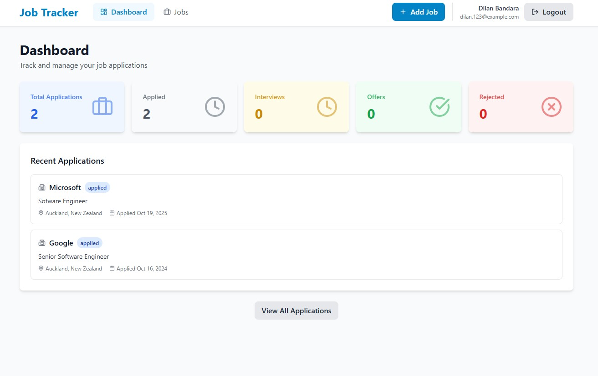
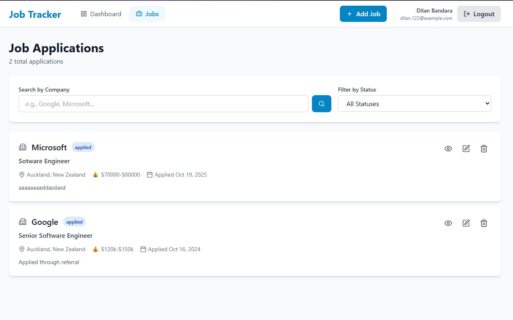
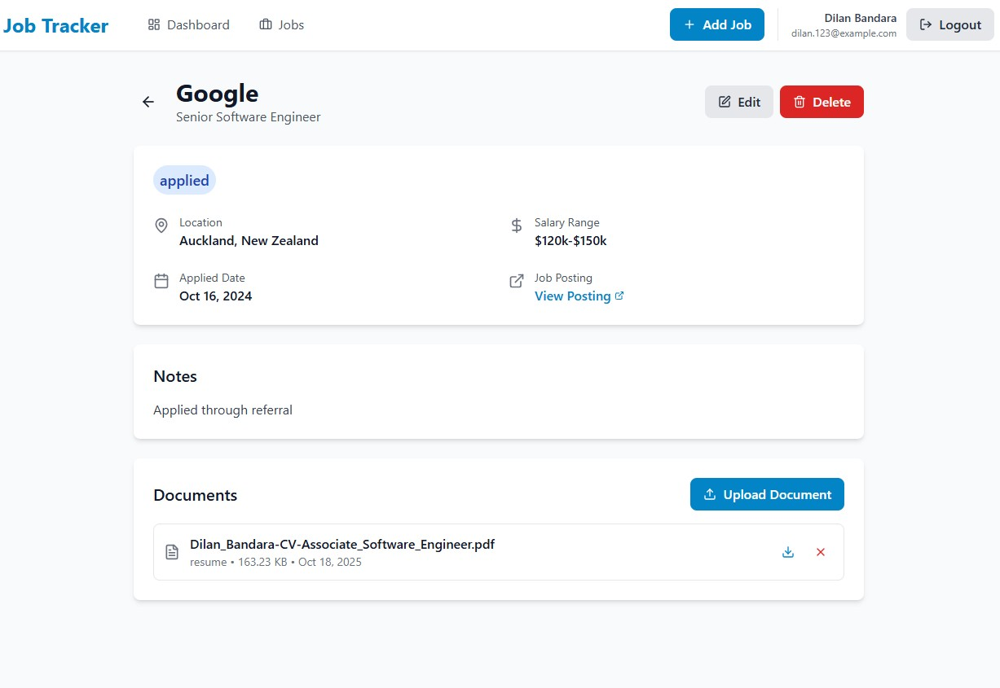
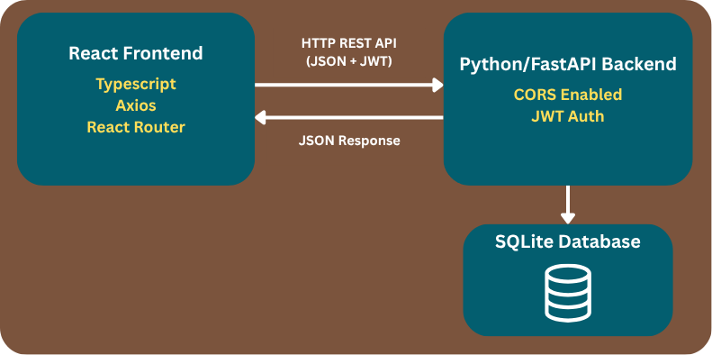

# 📋 Job Application Tracker

### A full-stack web application designed to help job seekers manage and track their job applications efficiently. This project was built as a learning initiative to master Python and FastAPI with the help of web, while transitioning from Java/Spring Boot development, demonstrating practical application of modern web development technologies and best practices.

## 📸 Screenshots

### Dashboard


### Job Applications List


### Job Details with File Upload


## ✨ Features

### Core Functionality
- ✅ **User Authentication** - Secure JWT-based authentication system
- ✅ **Job Application Management** - Complete CRUD operations
- ✅ **File Upload/Download** - Upload resumes and cover letters with secure storage
- ✅ **Dashboard Analytics** - Real-time statistics and insights
- ✅ **Advanced Filtering** - Search by company, filter by status
- ✅ **Pagination** - Efficient data loading for large datasets

### Technical Features
- ✅ RESTful API design with OpenAPI documentation
- ✅ Responsive design for mobile and desktop
- ✅ Protected routes and role-based access
- ✅ Form validation with detailed error messages
- ✅ Optimistic UI updates for better UX
- ✅ Docker containerization for easy deployment

## 🏗️ System Architecture

### High-Level Architecture



### Architecture Pattern: Layered Architecture

**Frontend (Presentation Layer)**
- React components for UI rendering
- Axios for HTTP API communication
- React Context API for global state management
- Protected routes with JWT authentication

**Backend (Application Layer)**
- **API Layer (Controllers):** Handle HTTP requests, validate input, return responses
- **Service Layer:** Business logic, authentication, file handling, data transformation
- **Repository Layer:** Database operations, queries, data persistence
- **Database Layer:** SQLite with SQLAlchemy ORM for data modeling

### Key Features
- **Direct API Communication:** Frontend calls backend REST APIs directly (no API Gateway)
- **Stateless Authentication:** JWT tokens for secure, scalable authentication
- **RESTful Design:** Standard HTTP methods (GET, POST, PUT, DELETE)
- **File Storage:** Local filesystem for uploaded documents
- **CORS Enabled:** Configured for cross-origin requests from frontend
- **Type Safety:** TypeScript on frontend, Pydantic validation on backend

## 🛠️ Tech Stack

### Backend
| Technology | Purpose |
|------------|---------|
| **FastAPI** | Modern Python web framework for building APIs |
| **SQLAlchemy** | SQL toolkit and ORM for database operations |
| **Pydantic** | Data validation using Python type hints |
| **Python-Jose** | JWT token generation and validation |
| **Passlib** | Password hashing with bcrypt |
| **Uvicorn** | ASGI server for running FastAPI |
| **SQLite** | Lightweight database (easily switchable to PostgreSQL) |

### Frontend
| Technology | Purpose |
|------------|---------|
| **React 18** | UI library for building interactive interfaces |
| **TypeScript** | Type-safe JavaScript for better development |
| **Vite** | Fast build tool and dev server |
| **React Router** | Client-side routing |
| **Axios** | HTTP client for API communication |
| **React Hook Form** | Efficient form handling and validation |
| **Tailwind CSS** | Utility-first CSS framework |
| **Lucide React** | Beautiful icon library |
| **date-fns** | Modern date utility library |

### DevOps
| Technology | Purpose |
|------------|---------|
| **Docker** | Containerization for consistent environments |
| **Docker Compose** | Multi-container orchestration |
| **Nginx** | Web server for serving frontend |

## 📦 Installation & Setup

### Prerequisites
- Python 3.10+
- Node.js 18+
- Docker & Docker Compose (optional)

### Method 1: Docker (Recommended)

```bash
# Clone the repository
git clone https://github.com/diliboy/Job-Tracker-Python_and_React.git
cd job-tracker

# Build and run with Docker Compose
docker-compose up --build

# Access the application
# Frontend: http://localhost
# Backend: http://localhost:8000
# API Docs: http://localhost:8000/api/docs
```

### Method 2: Manual Setup

#### Backend Setup

```bash
cd backend

# Create virtual environment
python -m venv venv

# Activate virtual environment
# Windows:
venv\Scripts\activate
# Mac/Linux:
source venv/bin/activate

# Install dependencies
pip install -r requirements.txt

# Create .env file
cp .env.example .env
# Edit .env with your configuration

# Run the application
uvicorn app.main:app --reload
```

#### Frontend Setup

```bash
cd frontend

# Install dependencies
npm install

# Create environment file
cp .env.example .env
# Edit .env if needed

# Run development server
npm run dev
```

## 🔐 Environment Variables

### Backend (.env)

```env
# Application
APP_NAME="Job Tracker API"
DEBUG=False
ENVIRONMENT=production

# Database
DATABASE_URL=sqlite:///./job_tracker.db

# Security
SECRET_KEY=your-super-secret-key-min-32-characters
ALGORITHM=HS256
ACCESS_TOKEN_EXPIRE_MINUTES=30

# CORS
ALLOWED_ORIGINS=http://localhost:3000,https://your-frontend-domain.com

# File Upload
UPLOAD_DIR=./uploads
MAX_UPLOAD_SIZE=5242880  # 5MB
```

### Frontend (.env)

```env
VITE_API_URL=http://localhost:8000/api/v1
```

## 🧪 API Documentation

The API documentation is automatically generated using FastAPI's built-in Swagger UI.

**Local:** http://localhost:8000/api/docs

## 🧪 Testing

```bash
# Backend tests
cd backend
pytest

# Frontend tests
cd frontend
npm test
```

## 📝 Future Enhancements

### Planned Features
- [ ] Email notifications for follow-up reminders
- [ ] Export applications to CSV/Excel
- [ ] Mobile app (React Native)

## 👤 Author

**Dilan Bandara**

- Portfolio: [portfolio.com](https://dilanbandara.vercel.app/)
- LinkedIn: [linkedin.com/in/profile](https://www.linkedin.com/in/dilanbandara/)
- GitHub: [@diliboy](https://github.com/diliboy)

⭐ **If you find this project helpful, please give it a star!** ⭐
